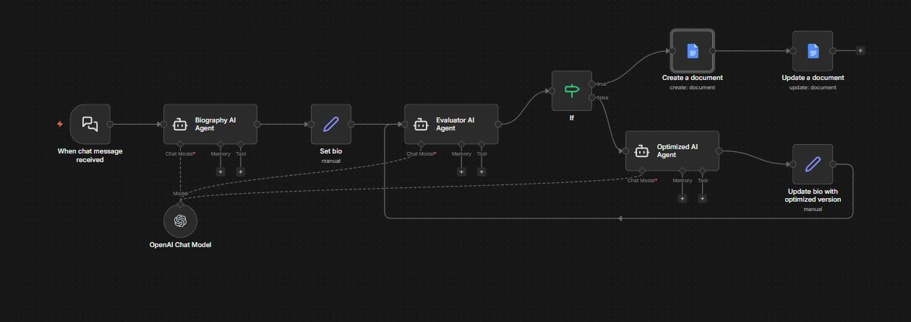
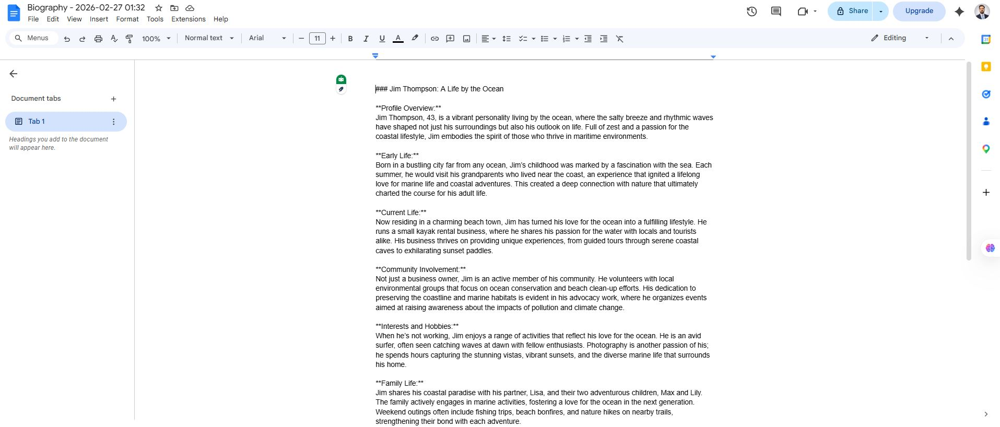

# BiographyCollectorN8N

An intelligent n8n workflow that automatically generates, evaluates, and optimizes personal biographies using AI agents. This workflow demonstrates advanced AI agent collaboration with continuous improvement loops.

## 🎯 Project Overview

The Biography Collector is a sophisticated automation workflow that:
- Generates comprehensive biographies from basic person information
- Evaluates biographies against quality criteria
- Optimizes content through iterative AI agent feedback
- Automatically saves final biographies to Google Docs

## 📋 Workflow Architecture

### Step-by-Step Process

#### 1. **Chat Input Trigger** 📥
- **Node**: "When chat message received"
- **Type**: LangChain Chat Trigger
- **Purpose**: Receives initial information about a person via chat interface
- **Input**: Basic details about the person (name, background, achievements, etc.)

#### 2. **Biography Generation** ✍️
- **Node**: "Biography AI Agent"
- **Type**: LangChain Agent
- **System Message**: "You are the expert biography writer. You will receive information about the person and your job is to create an entire profile using the information they give you. You are allowed to be creative and critical thinking."
- **Purpose**: Creates an initial comprehensive biography based on the provided information

#### 3. **Data Processing** 🔄
- **Node**: "Set bio"
- **Type**: Set Node
- **Purpose**: Captures and stores the generated biography in a variable for further processing
- **Operation**: Assigns the AI agent output to a "biography" field

#### 4. **Quality Evaluation** 🔍
- **Node**: "Evaluator AI Agent"
- **Type**: LangChain Agent
- **Evaluation Criteria**:
  - Must include quotes from the person (favorite saying or advice)
  - Should be light and humorous
  - Must contain no emojis
- **Output**: Either "Finished" (if all criteria met) or specific feedback for improvement

#### 5. **Conditional Routing** ⚡
- **Node**: "If"
- **Type**: IF Node
- **Logic**: Checks if evaluator output contains "Finished"
- **Paths**:
  - **True**: Biography meets quality standards → Proceed to document creation
  - **False**: Biography needs improvement → Route to optimization agent

#### 6. **Content Optimization** 🎨
- **Node**: "Optimized AI Agent"
- **Type**: LangChain Agent
- **System Message**: "You are an expert biography reviser. Your job is to take the biography and optimized it based on the feedback."
- **Input**: Original biography + evaluator feedback
- **Purpose**: Refines the biography based on specific improvement suggestions

#### 7. **Update & Loop** 🔄
- **Node**: "Update bio with optimized version"
- **Type**: Set Node
- **Purpose**: Updates the biography variable with the optimized version
- **Flow**: Routes back to the evaluator for quality check

#### 8. **Document Creation** 📄
- **Node**: "Create a document"
- **Type**: Google Docs
- **Operation**: Creates a new Google Doc with timestamped title
- **Format**: "Biography - {{yyyy-MM-dd HH:mm}}"
- **Folder ID**: Saves to specified Google Drive folder

#### 9. **Document Population** ✅
- **Node**: "Update a document"
- **Type**: Google Docs
- **Operation**: Inserts the final approved biography into the created document
- **Result**: Complete, formatted biography saved to Google Docs

#### 10. **AI Model Integration** 🤖
- **Node**: "OpenAI Chat Model"
- **Model**: GPT-4o-mini
- **Purpose**: Provides language model capabilities to all AI agents in the workflow

## 🔄 Workflow Loop Logic

The workflow implements a **continuous improvement loop**:

1. Generate → Evaluate → Check Quality
2. If quality standards met: Save to Google Docs ✅
3. If improvement needed: Optimize → Re-evaluate → Repeat 🔄

This ensures every biography meets the predefined quality criteria before finalization.

## 🚀 Key Features

### **Multi-Agent Collaboration**
- **Writer Agent**: Creative biography generation
- **Evaluator Agent**: Quality assessment and feedback
- **Optimizer Agent**: Content refinement based on feedback

### **Quality Assurance**
- Mandatory quote inclusion
- Tone requirements (light, humorous)
- Formatting standards (no emojis)
- Iterative improvement until standards met

### **Automated Documentation**
- Timestamped document creation
- Google Drive integration
- Professional formatting

### **Smart Routing**
- Conditional logic for quality gates
- Automatic loop-back for improvements
- Efficient resource usage

## 🛠️ Technical Requirements

### **n8n Nodes Used**
- LangChain Chat Trigger
- LangChain Agent (x3)
- Set Node (x2)
- IF Node
- Google Docs (x2)
- OpenAI Chat Model

### **Credentials Required**
- Google Docs OAuth2 API
- OpenAI API Key

### **Dependencies**
- n8n with LangChain integration
- Active OpenAI API access
- Google Drive permissions

## 📊 Workflow Benefits

1. **Consistency**: Every biography follows the same quality standards
2. **Efficiency**: Automated generation and evaluation saves time
3. **Quality Control**: Multi-agent review ensures high-quality output
4. **Scalability**: Can process multiple biography requests simultaneously
5. **Documentation**: Automatic archiving in Google Docs for easy access

## 🎯 Use Cases

- **Professional Bios**: Create LinkedIn profiles, company team pages
- **Personal Stories**: Generate engaging personal narratives
- **Content Creation**: Produce biography content for websites or publications
- **Documentation**: Create standardized biographical records

## 🔧 Customization Options

### **Modify Evaluation Criteria**
Edit the "Evaluator AI Agent" system message to change quality requirements:
- Add new criteria (word count, specific sections, etc.)
- Modify tone requirements
- Adjust formatting rules

### **Change Output Format**
Update Google Docs integration to:
- Use different document templates
- Export to different formats
- Send to additional destinations

### **Expand AI Capabilities**
- Add more specialized agents
- Implement different AI models
- Add multi-language support

## 📈 Performance Metrics

The workflow typically completes in 2-3 iterations:
- **First Pass**: Initial biography generation
- **Evaluation Loop**: 1-2 optimization cycles
- **Final Output**: Quality-approved biography in Google Docs

## 🔒 Security & Privacy

- All API credentials stored securely in n8n
- Google Drive access limited to specified folders
- No personal data stored in workflow logic
- Compliance with data protection regulations

---

## 📞 Support

For questions or issues with this workflow:
1. Check n8n execution logs
2. Verify API credentials and permissions
3. Review Google Drive folder access
4. Test individual nodes for connectivity

**Happy Biography Writing! 🎉**

